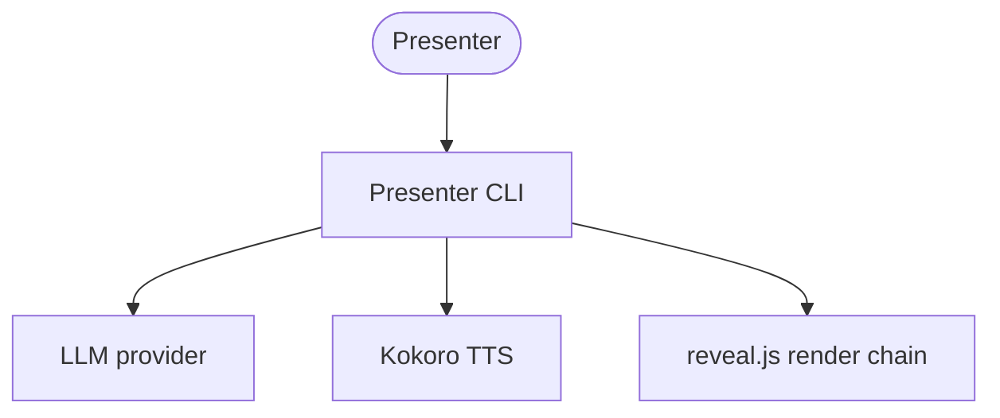
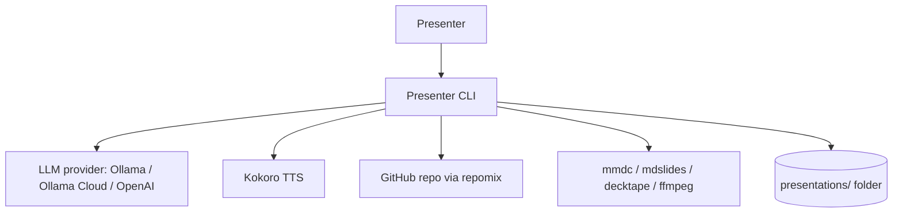
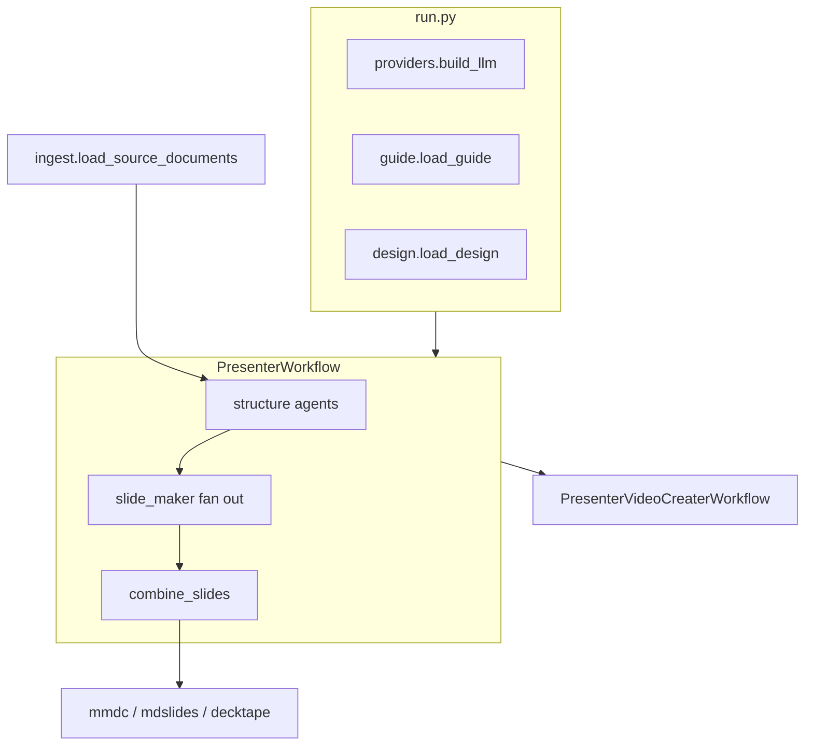
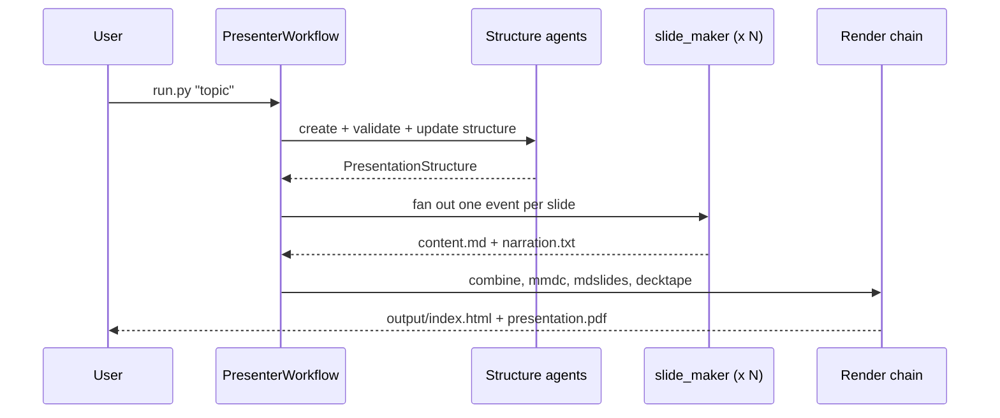
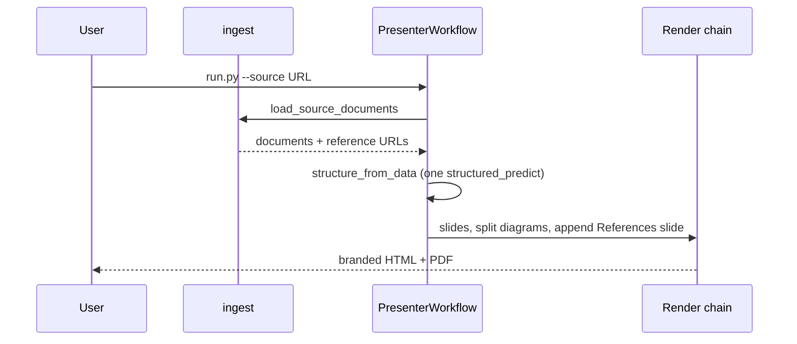
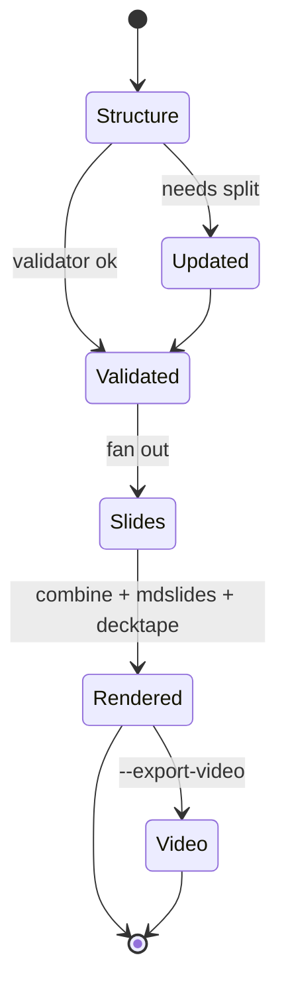
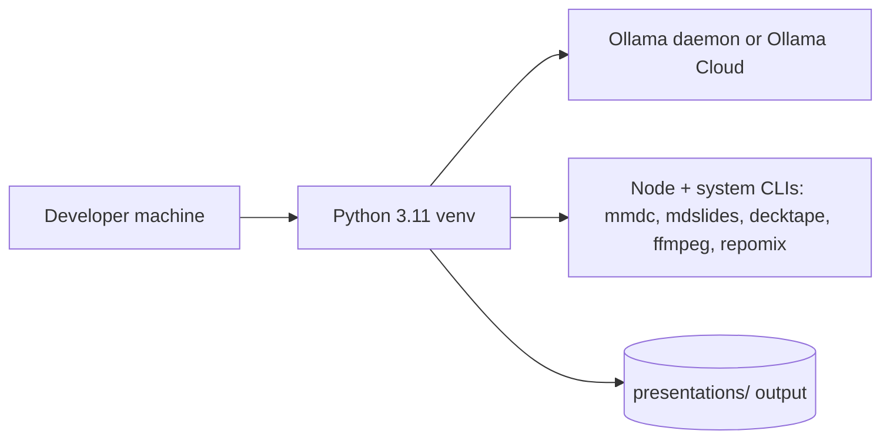
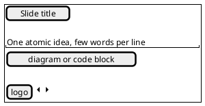

# Presenter Software Design Document

**System:** Presenter
**Version:** 0.2.0
**Status:** Accepted
**Audience:** Architects, implementers, reviewers
**Voice:** STE100
**Related requirements:** `README.md`, `CLAUDE.md`

This document uses the arc42 outline. Diagrams are Mermaid, except the screen wireframe, which is PlantUML Salt. All file paths and type names are taken from the repository.

---

## 1. Introduction and goals

Presenter is a command line tool that turns a topic or a set of source documents into a narrated slide deck. It generates a slide structure with a language model, writes each slide and its narration, renders a reveal.js HTML deck and a PDF, and can render a narrated MP4. The design encodes a set of presentation principles, so each deck opens with a problem hook, leads with a concrete example, goes deep on one idea, and closes on the key takeaway.

The tool runs local first. The default language model is a local Ollama model, and narration uses the offline Kokoro voice model, so a full deck can be produced without any paid cloud service. Ollama Cloud and OpenAI are selectable alternatives.

Primary users are developers and researchers who want to convert a topic, a Markdown document, or a GitHub repository into a talk.

### 1.1 Quality goals

| ID | Goal | Scenario |
|----|------|----------|
| QG-1 | Local and private operation | A user with a running Ollama daemon and Kokoro installed produces a full deck and MP4 with no network call to a paid provider. |
| QG-2 | Signal distillation | Given a 78 file repository, the deck presents one core idea across focused slides rather than a shallow list of every file. |
| QG-3 | Resumable runs | A rerun of the same topic reuses cached structure and slides and re-renders in seconds. |
| QG-4 | Extensibility | A new brand or a new content focus is added as a `DESIGN.md` or a guide file, with no change to the agents. |

### 1.2 Stakeholders

| Stakeholder | Expectation |
|-------------|-------------|
| Presenter (end user) | A one command path from a topic or source to a viewable deck. |
| Implementer | Clear module boundaries and a documented render pipeline. |
| Reviewer | Traceable requirements and the key architectural decisions. |



---

## 2. Constraints

- Business: single user command line tool, open source, no server component.
- Technical: Python 3.11 is required, because `kokoro` publishes no wheel for Python 3.13 or later. Orchestration uses LlamaIndex Workflows 0.14. Rendering depends on external command line tools: `ollama`, `mmdc`, `mdslides`, `decktape`, `ffmpeg`, `ffprobe`, `repomix`, and `git`. Every language model call uses structured output, so the selected model must support tool or JSON schema output.
- Legal and privacy: when a cloud provider is selected, slide source text is sent to that provider. Repository content is packed by `repomix`, which runs a Secretlint scan before the text reaches the model. Secrets live in `.env`, which is git ignored.

---

## 3. Context and scope

Presenter is a local process started from a shell. It reads a topic or a source, calls a language model and a text to speech engine, and writes files under `presentations/`.

**In scope:** topic to deck, source to deck, HTML and PDF output, optional MP4, theming, content steering, source citation.
**Out of scope:** hosting or serving decks, live slide editing, user accounts, multi user collaboration.

Actors and external systems:

- Presenter: the user who runs the CLI.
- LLM provider: a local Ollama daemon, Ollama Cloud, or OpenAI.
- Kokoro model: a local text to speech model.
- GitHub: the origin of a repository source, reached through `repomix`.
- Renderers: `mmdc`, `mdslides`, `decktape`, `ffmpeg` as local subprocesses.



---

## 4. Solution strategy

The design rests on a small set of choices. Each is recorded as an ADR in section 9.

- Event driven orchestration with LlamaIndex Workflows, so slide work fans out across workers and joins on a collector step (ADR-001).
- A single provider factory that hides the model backend behind the abstract `LLM` type (ADR-002).
- A filesystem cache that makes reruns incremental and idempotent (ADR-003).
- Repository ingestion through `repomix`, for a secret scan and gitignore aware packing (ADR-004).
- Branding applied by post processing the rendered HTML, not by forking `mdslides` (ADR-005).
- One structured prediction over a small, prioritized source blob, in place of a tree summarize chain (ADR-006).

---

## 5. Building block view

| Building block | Responsibility | Requirements |
|----------------|----------------|--------------|
| `run.py` | Parse the CLI, build the provider, load guide and design, run the workflows. | FR-1, FR-2, FR-4, FR-5, FR-6, FR-7 |
| `providers.py` | `build_llm` returns an `LLM` for ollama, ollama-cloud, or openai. | FR-7 |
| `ingest.py` | `load_source_documents` packs a repo or reads local files, caps and prioritizes text, rejects thin sources, and extracts reference URLs. | FR-2, FR-9, FR-10 |
| `guide.py` | Load a SKILL.md or AGENT.md guide and format it as a steering block. | FR-5 |
| `design.py` | Parse a DESIGN.md, emit reveal config and brand CSS, and inject branding into the deck. | FR-6 |
| `workflow.py` (`PresenterWorkflow`) | Orchestrate structure, validation, slide fan out, render, split, and citation. | FR-1, FR-2, FR-3, FR-8, FR-10 |
| `agents/structure_creater*.py` | Generate the slide structure from a topic or from source text. | FR-1, FR-2 |
| `agents/structure_validator.py`, `structure_updater.py` | Critique and refine the structure. | FR-1 |
| `agents/slide_maker.py` | Compose one slide and its narration. | FR-1 |
| `agents/narrator.py` | Synthesize narration audio with Kokoro. | FR-4 |
| `agents/video_creator.py` (`PresenterVideoCreaterWorkflow`) | Build per slide clips and concatenate the MP4. | FR-4 |
| `models.py` | Pydantic types for structured output. | FR-1 |
| `utils.py` | Markdown sanitizing, diagram splitting, references slide, config. | FR-3, FR-10 |
| `images.py` | Fetch an optional inline photo per slide (Pollinations, Pexels, or Picsum), with a Picsum fallback. | FR-11 |



### 5.1 Directory tree

```text
run.py                 # CLI entrypoint, provider + guide + design wiring
workflow.py            # PresenterWorkflow: structure -> slides -> render
providers.py           # build_llm factory (ollama, ollama-cloud, openai)
ingest.py              # repomix + local ingestion, caps, gate, URL extraction
guide.py               # content steering (SKILL.md / AGENT.md)
design.py              # DESIGN.md branding + voice, HTML injection
models.py              # Pydantic structured-output types
utils.py               # sanitize, diagram split, references slide, config
agents/
  structure_creater.py            # topic -> structure
  structure_creater_from_data.py  # source text -> structure
  structure_validator.py          # critique structure
  structure_updater.py            # apply feedback
  slide_maker.py                  # one slide + narration
  narrator.py                     # Kokoro TTS
  video_creator.py                # PresenterVideoCreaterWorkflow
designs/                # example DESIGN.md themes (midnight, sunrise)
guides/                 # example steering skill (token-focus)
requirements.txt
.env.example
```

---

## 6. Runtime view

### 6.1 Topic to deck



### 6.2 Source to deck



### 6.3 Lifecycle

Each expensive step checks for its output file and returns early when present, so a rerun resumes.



---

## 7. Deployment view



Runtime: one local Python process. No server and no database. Configuration comes from `.env` and CLI flags. Output files land under `presentations/<safe_topic>/`. Observability is limited to console progress lines.

---

## 8. Crosscutting concepts

- Configuration: three layers. CLI flags, then `.env` variables (`LLM_PROVIDER`, `LLM_MODEL`, `OLLAMA_BASE_URL`, `OLLAMA_CLOUD_API_KEY`, `OPENAI_API_KEY`), then built in defaults in `providers.py`.
- Content steering: `guide.py` injects a guide body, and `design.py` adds the DESIGN.md voice, into one steering block passed to every generation prompt.
- Error handling: the per slide compose step and the narrate step use a `ConstantDelayRetryPolicy`, which absorbs transient model or audio failures.
- Extensibility: providers, guides, and designs are the extension points. A new backend is a branch in `build_llm`. A new brand or focus is a new file.
- Rendering fixes: `utils.sanitize_markdown` corrects Mermaid and heading issues before render. `utils.split_oversized_diagrams` moves a tall diagram onto its own slide. `design.apply_branding` injects a diagram fit cap and brand CSS.
- Security: `repomix` runs a secret scan before repository text reaches the model. `.env` is git ignored. A personal `DESIGN.md` at the project root is git ignored.

---

## 9. Architectural decisions

### ADR-001: LlamaIndex Workflows for orchestration

**Status:** Accepted
**Context:** Slide work is embarrassingly parallel, and the flow has clear stages.
**Decision:** Use LlamaIndex Workflows. Steps emit events, a worker step composes slides in parallel, and a collector step joins with `ctx.collect_events`.
**Consequences:** Parallel slide generation and a clear stage graph. The 0.14 Context API (`ctx.store`) is a version constraint.
**Alternatives:** A hand written async pipeline, rejected for more boilerplate.

### ADR-002: Provider factory over the abstract LLM type

**Status:** Accepted
**Context:** The tool must run local first, with cloud as an option.
**Decision:** `providers.build_llm` returns an `LLM`. Every agent takes the abstract type. Ollama Cloud is reached through `OpenAILike` at the OpenAI compatible endpoint.
**Consequences:** One construction site. A new backend is one branch.
**Alternatives:** Direct client calls in each agent, rejected for coupling.

### ADR-003: Filesystem cache for resumable runs

**Status:** Accepted
**Context:** Runs are long and often repeated after a small change.
**Decision:** Persist `structure.pkl`, per slide `content.md` and `narration.txt`, `narration.mp3`, and `clip.mp4`. Each step skips work when its output exists.
**Consequences:** Fast reruns. Stale output requires a manual delete.
**Alternatives:** A database, rejected as too heavy for a single user tool.

### ADR-004: Repomix for repository ingestion

**Status:** Accepted
**Context:** A repository must be fetched, filtered, and scanned before its text reaches a cloud model.
**Decision:** Pack a repo with `repomix`, restricted to documentation globs, then prioritize and cap the packed text.
**Consequences:** A Secretlint scan, gitignore awareness, and less code to maintain. It adds a Node dependency.
**Alternatives:** A hand written clone and walk, rejected for missing the secret scan.

### ADR-005: Branding by HTML post processing

**Status:** Accepted
**Context:** `mdslides` has no custom CSS hook.
**Decision:** Inject brand CSS, a logo, and a diagram fit cap into `output/index.html` after `mdslides` and before `decktape`, so the PDF inherits the theme.
**Consequences:** No fork to maintain. The injection depends on stable anchors in the generated HTML.
**Alternatives:** Fork `mdslides`, deferred as future work.

### ADR-006: One structured prediction for the source path

**Status:** Accepted
**Context:** A tree summarize chain over a large source made many slow model calls.
**Decision:** Cap the prioritized source to a small blob and run one `structured_predict`. The source text is passed as a value, so braces inside code are safe.
**Consequences:** Faster runs and predictable cost. Very large sources are truncated by design.
**Alternatives:** SummaryIndex tree summarize, removed for latency.

---

## 10. Quality requirements

| ID | Requirement | Risk | Verify |
|----|-------------|------|--------|
| NFR-001 | The system shall produce a deck offline when the provider is a local Ollama model and Kokoro is installed. | Medium | Manual run with the network disabled. |
| NFR-002 | The system shall reuse cached artifacts on a rerun of the same topic. | Low | Rerun and confirm no regeneration. |
| NFR-003 | The system shall reject a source with less than the minimum extractable text. | Low | Point at a thin source and confirm the error. |
| NFR-004 | The system shall keep a repository source within a size that fits one model call. | Medium | Ingest a large repo and confirm the cap. |
| NFR-005 | The system shall not upload repository secrets, within the limits of the Secretlint scan. | High | Inspect the packed output for a seeded secret. |

### Functional requirements

- FR-1 topic to deck. FR-2 source to deck. FR-3 HTML and PDF output. FR-4 narrated MP4. FR-5 content steering. FR-6 branding. FR-7 provider selection. FR-8 resumable runs. FR-9 reject thin sources. FR-10 cite sources. FR-11 optional inline slide images.

---

## 11. Risks and technical debt

- Structured output reliability varies by model. A weak local model can return malformed output on the source path. Mitigation: recommend `qwen2.5:7b` or a strong cloud model, and retry on slide steps.
- The diagram split changes the slide count, which would desync the per slide narration. Mitigation: the split is disabled under `--export-video`.
- The Python 3.11 pin is driven by `kokoro`. A future Kokoro release may lift it.
- `sanitize_markdown` carries render specific fixes for Mermaid. These are brittle and tied to the current renderer versions.
- Branding injection depends on stable anchors (`</head>`, `<div class="reveal">`) in the `mdslides` output.
- The optional image feature depends on a third-party network service. Pollinations has no SLA, is slow (about 20 to 40 seconds per image), and returns occasional errors. Mitigation: the feature is opt-in, fetches are sequential and capped, results are cached, and Picsum is the fallback.

---

## 12. Glossary

| Term | Meaning |
|------|---------|
| SDD | Software design document, this document. |
| arc42 | The twelve section design outline used here. |
| ADR | Architecture decision record. |
| LlamaIndex Workflow | The event driven orchestration engine that runs the steps. |
| structured_predict | A model call that returns a typed Pydantic object. |
| Ollama | A local server that serves language models, with an optional cloud tier. |
| Kokoro | An offline text to speech model. |
| repomix | A CLI that packs a repository into one text file and scans for secrets. |
| mmdc | The Mermaid CLI that renders diagrams to PNG. |
| mdslides | The markdown-slides tool that renders Markdown to a reveal.js deck. |
| decktape | A CLI that exports a reveal.js deck to PDF. |
| reveal.js | The HTML presentation framework used for the deck. |
| DESIGN.md | A brand and voice file, distinct from this DESIGN_DOC.md. |
| guide | A SKILL.md or AGENT.md file that steers deck content. |
| STE100 | The controlled English voice pack used for this document. |

### UI wireframe: rendered slide

The one user facing surface is the rendered reveal.js slide. The Salt source below describes the content slide layout. A reviewer can render it to PNG with PlantUML and place the image at `docs/diagrams/slide-screen.png`.


